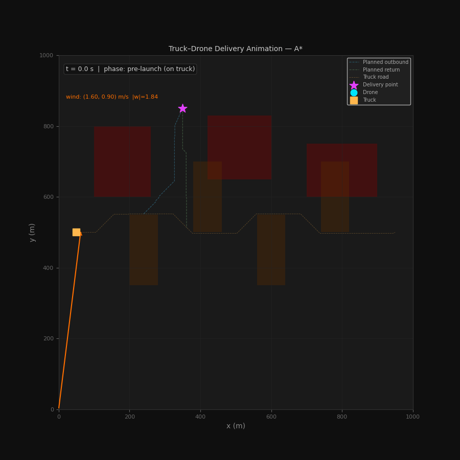
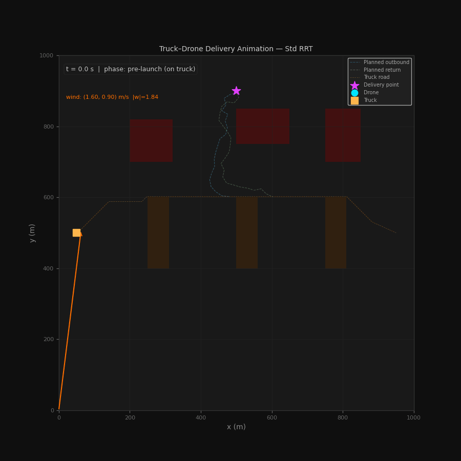

# Truck Drone Cooperative Delivery

Below is an example output animation from the truck/drone simulation (from `mpc_animation_astar.gif`):





This repository contains a truck and drone delivery simulation with path planning and MPC based tracking under wind disturbances.

For the full project explanation, methodology, and results, please read the report: `Drone_Project.pdf`.

## How to Run

Use Python 3 and install the required packages:

```bash
pip install numpy scipy matplotlib
```

If you want to change the scenario, edit `map_config.py` and choose the map configuration you want to use.

Then run the project in this order:

1. Create the map files:

```bash
python3 map.py
```

2. Generate the initial truck/drone paths:

```bash
python3 init_path.py
```

3. Run the MPC simulation and produce the plots and animations:

```bash
python3 mpc.py
```

## Output Files

Running the scripts will generate files such as:

- `map.npz`
- `step1_map.png`
- `init_path_results.npz`
- MPC plots like `mpc_path_astar.png`, `mpc_energy_rrt.png`
- Animations like `mpc_animation_astar.gif`

The report explains the problem formulation and methodology in detail: `Drone_Project.pdf`.
